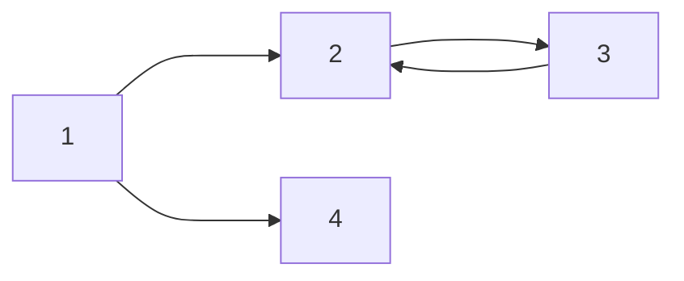

\#은 HEADER를 의미합니다.

# H1 태그
## H2 태그
### H3 태그
#### H4 태그

*italic*
_italic_
**bold**
__bold__
***italic+bold***
~~jul 되는것도 있고 안되는 것도 있음~~

인용문
> 재밌네 마크다운 - **박준형**


### list


- list 1
- list 2
1. list 1
2. list 2


### 표

|제목|설명|비고|
|-|-|-|
|안녕|1|2|
|할로|3|4|


### 링크
[링크이름](naver.com)
<a href="naver.com">링크이름</a>


이미지를 불러오지 못하면 [] 내 텍스트 노출 / 크기는 와이드


백슬래쉬(원 표시) : 코드 블록 표시
`simple code`

sh(shell), python, c, cpp

```cpp #문법 표시
#include <iostream>

int main(){
    cout << "hellow world";
}
```

```sh
wow text 는 이걸로 정리하기도 함
```


### latex문법
$a + b = c$
$a^2 + b^2 = c^2_1$
hello $ a + b = cc $ baby
hello $$(\alpha + \beta)^2 = \alpha^2$$
- $$는 가운데 표시되고 양 옆에 문자열이 올 수가 없다


###mermaid : 다이어그램 그려주는 툴



